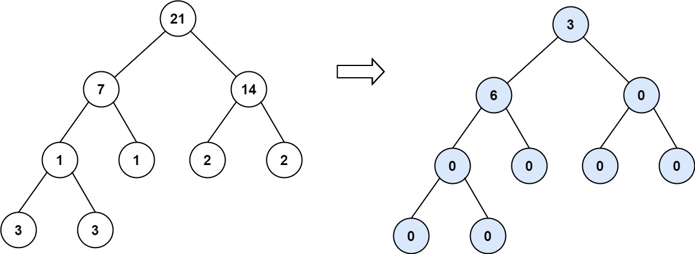

# Binary Tree Tilt

Given the `root` of a binary tree, return the tilt of the whole tree.

The tilt of a **tree node** is the **absolute difference** between the sum of all left subtree node values and all right subtree node values. Null node has tilt 0.

The tilt of the **whole tree** is the sum of all nodes' tilt.

**Example 1:**


```pseudo
Input: root = [1,2,3]
Output: 1
Explanation:
Tilt of node 2 : 0
Tilt of node 3 : 0
Tilt of node 1 : |2-3| = 1
Tilt of binary tree : 0 + 0 + 1 = 1
```

**Example 2:**


```pseudo
Input: root = [4,2,9,3,5,null,7]
Output: 15
Explanation:
Tilt of node 3 : 0
Tilt of node 5 : 0
Tilt of node 7 : 0
Tilt of node 2 : |3-5| = 2
Tilt of node 9 : |0-7| = 7
Tilt of node 4 : |(3+5+2)-(9+7)| = 6
Tilt of binary tree : 0 + 0 + 0 + 2 + 7 + 6 = 15
```

**Example 3:**



```pseudo
Input: root = [21,7,14,1,1,2,2,3,3]
Output: 9
```

**Constraints:**

- The number of nodes in the tree is in the range `[0, 10^4]`.
- `-1000 <= Node.val <= 1000`
